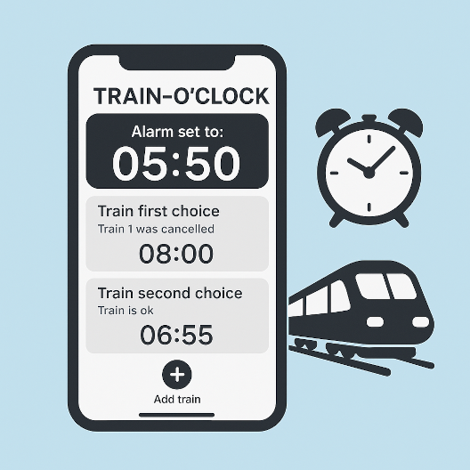

# 🚆 Train-O'Clock



**Train-O'Clock** is a smart mobile app that automatically adjusts your alarm clock based on your preferred train schedules and their real-time availability. No more waking up early for a canceled train

## 🧠 Concept

Train-O'Clock enables users to:

- Define multiple train options (ranked by priority)
- Check live train availability or cancellations
- Automatically compute the ideal wake-up time based on the next available train
- Get a clear daily summary with alarm time and train choices

## 📱 User Interface Overview

The app is structured around three main views:

### 1. **Home (Today View)**

- Displays the current alarm time.
- Lists first and second-choice trains.
- Indicates real-time train status (e.g., canceled, OK).
- Allows adding new trains.

### 2. **Wake Up View**

- Visual timeline from wake-up to train station arrival.
- Helps adjust prep time and visualize the window before departure.

### 3. **Settings View**

- (To be detailed) — user preferences and app configuration.

## ⚙️ Core Features (To Be Developed)

- 📡 **Live Train API Integration**: Fetch real-time data from train services
- ⏰ **Dynamic Alarm Calculation**: Based on desired arrival time and commute prep duration.
- 📲 **Modular UI**: Drag-and-drop to reorder preferred trains.

## 🛠️ Tech Stack

- **Frontend**: React Native with [Expo](https://expo.dev)
- **Backend**: Without at the moment
- **APIs**: [SNCF Numériques](https://numerique.sncf.com/startup/api/token-developpeur/)

## 🚀 Getting Started

This is an [Expo](https://expo.dev) project created with [`create-expo-app`](https://www.npmjs.com/package/create-expo-app).

```bash
# Clone the repository
git clone https://github.com/Happy4Game/train-o-clock.git
cd train-o-clock

# Install dependencies
npm install

# Start the development server
npx expo start
```
